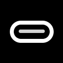

# 🐠 Tidefish

<div align="center">



**A powerful desktop application for Android device management and debugging**

[](LICENSE)
[](https://kotlinlang.org/)
[](https://www.jetbrains.com/lp/compose-multiplatform/)
[]()

[Download](#installation) • [Features](#features) • [Documentation](#documentation) • [Contributing](#contributing)

</div>

## 📋 Overview

Tidefish is a comprehensive Android Debug Bridge (ADB) GUI client built with Kotlin and Compose Desktop. It provides developers and power users with an intuitive interface to manage, debug, and interact with Android devices through a desktop application.

### 🎯 Key Benefits

- **Device Management**: Connect and manage multiple Android devices simultaneously
- **App Management**: View, install, uninstall, and manage applications
- **Communication Analysis**: Access and analyze SMS/MMS messages and call logs
- **File Management**: Browse and manage device files through an intuitive interface
- **ADB Terminal**: Execute ADB commands directly from the GUI
- **Cross-Platform**: Works on Windows, macOS, and Linux

## ✨ Features

### 📱 Device Management
- **Device Discovery**: Automatically detect connected Android devices
- **Device Information**: View detailed device specifications and status
- **Multi-Device Support**: Manage multiple devices simultaneously
- **Real-time Status**: Monitor device connection status in real-time

### 📲 Application Management
- **App Listing**: View all installed applications with detailed information
- **App Details**: Package name, version, permissions, and storage usage
- **App Actions**: Uninstall, clear data, force stop applications
- **Search & Filter**: Quickly find specific applications

### 💬 Communication Analysis
- **Message Management**: View and analyze SMS/MMS messages
- **Conversation Threads**: Group messages by conversation
- **Call Logs**: Access and analyze call history
- **Search Functionality**: Search messages and calls by content or date

### 📁 File Operations
- **File Browser**: Navigate device file system
- **File Transfer**: Upload and download files between device and computer
- **Directory Operations**: Create, rename, and delete directories

### 🔧 Advanced Tools
- **ADB Terminal**: Execute ADB commands with syntax highlighting
- **Screen Capture**: Take screenshots of connected devices
- **Logcat Viewer**: Monitor system and application logs
- **Service Management**: View and control system services

## 🚀 Installation

### Download Releases

1. Visit the [Releases](https://github.com/your-repo/tidefish/releases) page
2. Download the appropriate package for your operating system:
   - **Windows**: `.msi` installer
   - **macOS**: `.dmg` disk image
   - **Linux**: `.deb` package

### System Requirements

- **Java**: JDK 17 or higher
- **ADB**: Android Debug Bridge (included with auto-update)
- **Operating System**: Windows 10+, macOS 10.15+, or Ubuntu 18.04+

### Quick Start

1. Install Tidefish using the appropriate package for your system
2. Launch the application
3. Connect your Android device via USB with USB debugging enabled
4. Tidefish will automatically detect and display your device

## 📖 Usage

### Basic Device Connection

1. Enable USB Debugging on your Android device:
   - Go to Settings → About Phone
   - Tap "Build Number" 7 times to enable Developer Options
   - Go to Developer Options and enable "USB Debugging"

2. Connect your device via USB cable

3. Tidefish will automatically detect and display connected devices

### Main Interface

The application is organized into several main screens:

- **Apps Screen**: Manage installed applications
- **Messages Screen**: View SMS/MMS messages
- **Call Logs Screen**: Access call history
- **Media Screen**: Browse media files
- **Services Screen**: Monitor system services
- **Settings Screen**: Configure application preferences

### Keyboard Shortcuts

| Shortcut | Action |
|----------|--------|
| `Ctrl+R` | Refresh device list |
| `Ctrl+T` | Open ADB terminal |
| `Ctrl+S` | Take screenshot |
| `Ctrl+F` | Search current view |
| `F5` | Refresh current screen |

## 🏗️ Architecture

Tidefish is built using modern desktop application architecture:

- **Framework**: Kotlin with Compose Desktop
- **Architecture**: MVC pattern with separate controllers, models, and views
- **ADB Integration**: Direct ADB command execution with result parsing
- **UI Framework**: FlatLaf for modern look and feel
- **Data Processing**: Kotlinx Coroutines for asynchronous operations

### Key Components

- **ADB Helper**: Core ADB command execution and device communication
- **Screen Controllers**: Manage individual screen logic and data
- **UI Components**: Reusable Compose UI components
- **Data Models**: Structured data representation for device information

## 🔧 Development

### Prerequisites

- JDK 17 or higher
- IntelliJ IDEA or Android Studio
- Git

### Building from Source

```bash
# Clone the repository
git clone https://github.com/your-repo/tidefish.git
cd tidefish

# Build the application
./gradlew build

# Run the application
./gradlew run
```

### Creating Distribution Packages

```bash
# Create all distribution packages
./gradlew createDistributables

# Create specific platform packages
./gradlew createDistributableForCurrentOS
```

## 📚 Documentation

- [Feature Documentation](documentation/features/) - Detailed feature descriptions
- [API Reference](docs/api/) - ADB command reference
- [Troubleshooting](docs/troubleshooting.md) - Common issues and solutions

## 🤝 Contributing

We welcome contributions! Please see our [Contributing Guide](CONTRIBUTING.md) for details.

### Development Workflow

1. Fork the repository
2. Create a feature branch (`git checkout -b feature/amazing-feature`)
3. Commit your changes (`git commit -m 'Add amazing feature'`)
4. Push to the branch (`git push origin feature/amazing-feature`)
5. Open a Pull Request

### Code Style

- Follow Kotlin coding conventions
- Use meaningful variable and function names
- Add documentation for public APIs
- Include unit tests for new features

## 🐛 Bug Reports

If you encounter a bug, please:

1. Check existing [Issues](https://github.com/your-repo/tidefish/issues)
2. Create a new issue with:
   - Detailed description of the problem
   - Steps to reproduce
   - System information (OS, Java version, etc.)
   - Relevant logs or screenshots

## 📄 License

This project is licensed under the MIT License - see the [LICENSE](LICENSE) file for details.

## 🙏 Acknowledgments

- [Kotlin](https://kotlinlang.org/) - The programming language
- [Compose Desktop](https://www.jetbrains.com/lp/compose-multiplatform/) - UI framework
- [FlatLaf](https://www.formdev.com/flatlaf/) - Look and Feel
- [Android Debug Bridge](https://developer.android.com/studio/command-line/adb) - Core device communication

## 📞 Support

- **Documentation**: [Wiki](https://github.com/your-repo/tidefish/wiki)
- **Issues**: [GitHub Issues](https://github.com/your-repo/tidefish/issues)
- **Discussions**: [GitHub Discussions](https://github.com/your-repo/tidefish/discussions)
- **Email**: support@tidefish.app

---

<div align="center">

**Made with ❤️ by the Tidefish Team**

[Website](https://tidefish.app) • [Twitter](https://twitter.com/tidefishapp) • [Discord](https://discord.gg/tidefish)

</div>